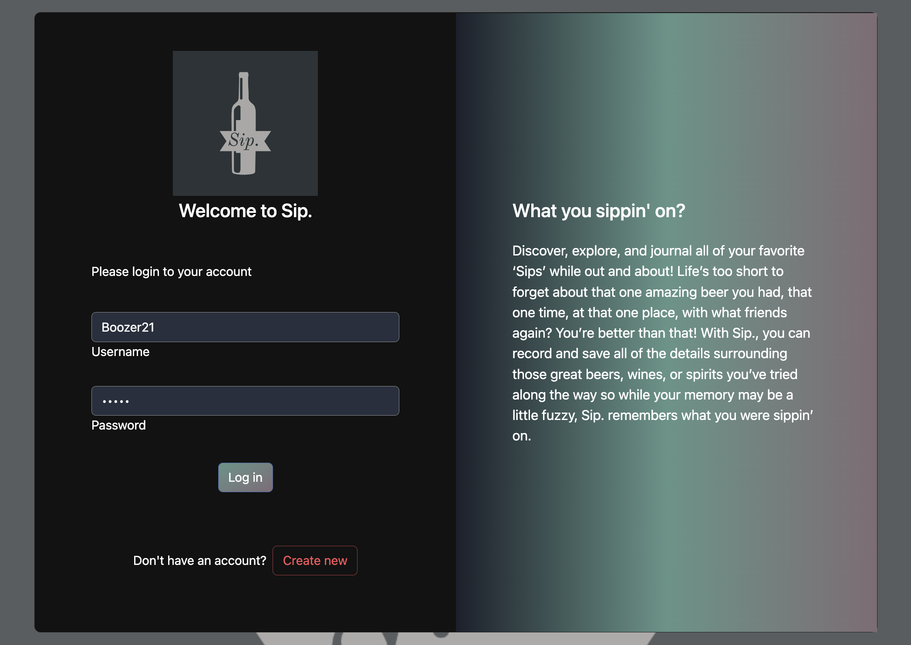
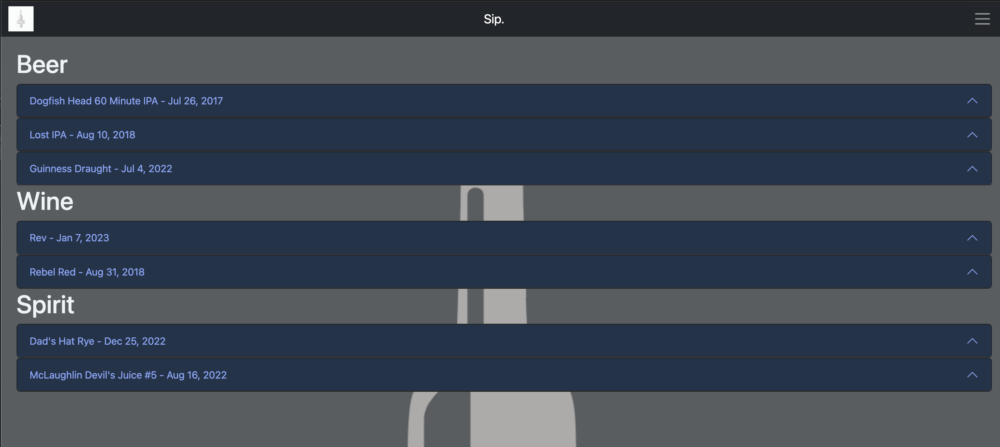
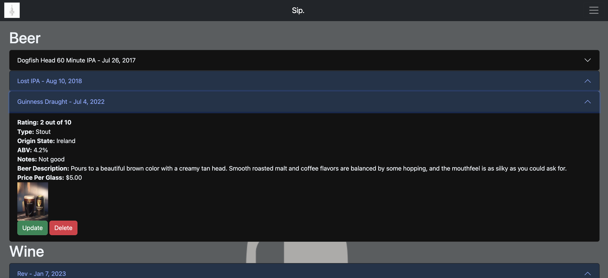
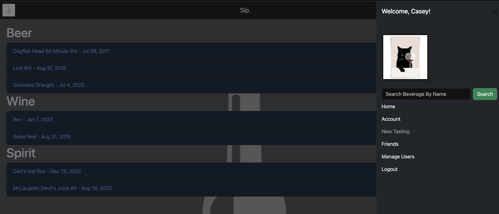
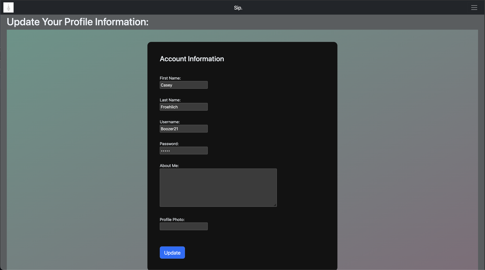
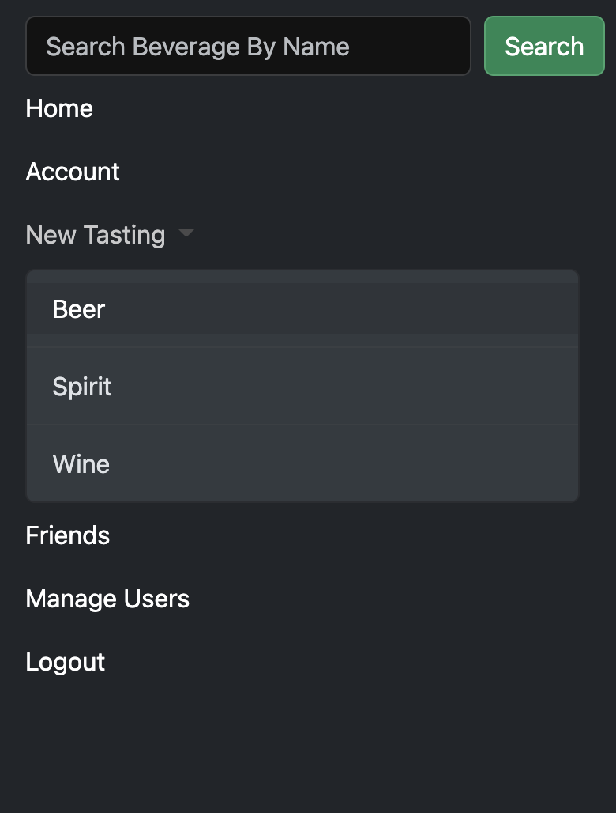
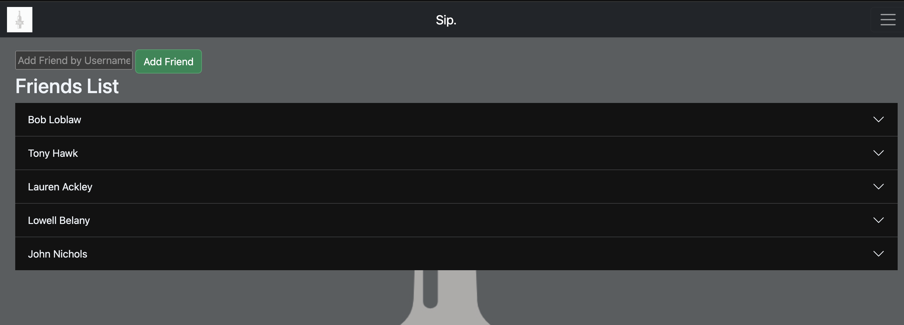
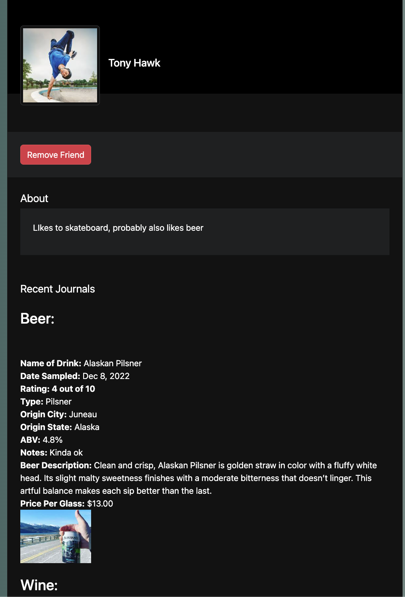
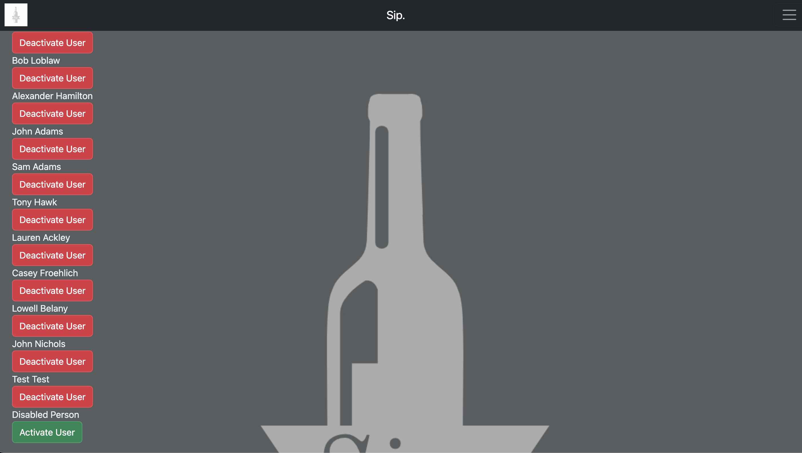
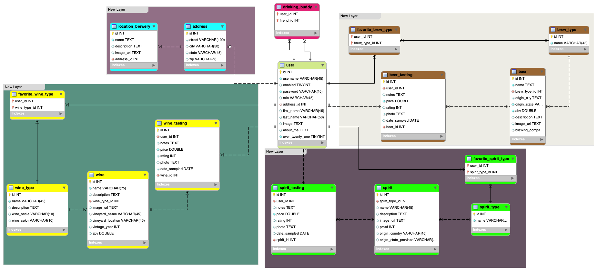

### Full Stack MVC Group Project

<strong> SIP. </strong>

Team Members:
<ul>
<li>Lowell Belany (Developer)</li>
<li>John Nichols (Developer, Repo Owner)</li>
<li>Lauren Ackley (Developer, DBA)</li>
<li>Casey Froehlich (Developer, Scrum Master)</li>
</ul>

<strong><em>What is Sip.?</strong></em>

Sip., is a web based application that allows a user to create journal entries based upon different alcoholic beverages they've tried. The purpose of the journal entry is to save and store the information about a specific drink for the user. For example, if you were a wine connoisseur you could add unique journal entries detailing all of the different wines you've tasted. Perhaps you had a fantastic wine while dining with friends down the street or a lovely pinot noir while traveling abroad in Italy, you can create and save those memories in the Sip. application.

### <strong>How It Works:</strong>

<strong><em>When a user accesses the welcome page they can:</strong></em>
<ul>
<li> Existing user? Add your username and password to login</li>
<li> New user? Select "Create New" to register your new account<li>
</ul>

<strong><em>Once logged in the user has the following options:</strong></em>
<ul>
<li> Read previous journal entries on the home page</li>

<strong><em>From the navigation bar:</strong></em>
<li> Search previous entry by drink name</li>
<li> View  and update their personal account information</li>
<li> Create a new tasting (beer, wine, spirit)</li>
<li> View friends list where the user can search and add a new friend or remove friends from current list</li>
<li> Logout</li>
<li> If the user has admin privileges they will also be able to "Manage Users" from the navigation bar where they can activate and deactivate users</li>
 </ul>

<strong><em> How CRUD was implemented:</strong></em>

 <strong><em>Create:</strong></em>
 <ul>
 <li> User can create an account</li>
 <li> User can create a beer, wine, or spirit journal</li>
 </ul>

<strong><em>Read:</strong></em>
 <ul>
 <li> User can search for existing journal entry by drink name</li>
 <li> User can view previous journal entries</li>
 <li> User can search for friends by username</li>
 </ul>

<strong><em> Update:</strong></em>
 <ul>
 <li> User can update personal account information</li>
 <li> User can update previous journal entries</li>
 <li> User can add or remove friends from friends list</li>
 <li> User can delete previous journal entries</li>
 </ul>
  
  

 
  
  
  
   
   
  
    
    
  
     
     
  
   
   
  
    
    
  
     
      
  
       
       
   

### <strong>Technologies Used:</strong>

<ul>
<li>Java</li>
<li>MySQL</li>
<li>HTML</li>
<li>CSS</li>
<li>SQL</li>
<li>JPQL</li>
<li>MySQL Workbench</li>
<li>Atom</li>
<li>Bootstrap</li>
<li>Unix Terminal</li>
<li>Spring</li>
<li>Spring Boot</li>
<li>JPA</li>
<li>Spring Tools Suite</li>
<li>Chrome</li>
<li>Git</li>
<li>Slack</li>
<li>Zoom</li>
<li>Trello</li>
</ul>

### <strong>Lessons Learned:</strong>

ADD LESSONS LEARNED SECTION
### <strong>Stretch Goals Implemented:</strong>
<ul>
<li> Give user ability to follow, add, and remove friends</li>
<li> Give user ability to view friends profile page</li>
<li> Give admin ability to activate/deactivate other user accounts</li>
</ul>

### <strong>How To Run:</strong>

Go to: http://52.5.120.254:8080/Sip/
<ul>
<li> Register a new account</li>
<li> Start adding journal entries! </li>
</ul>
